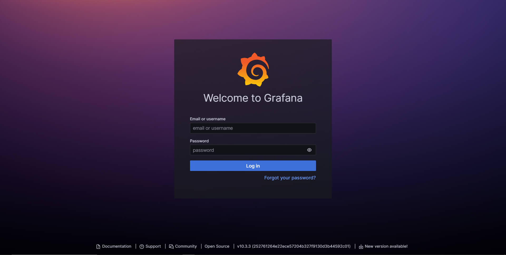
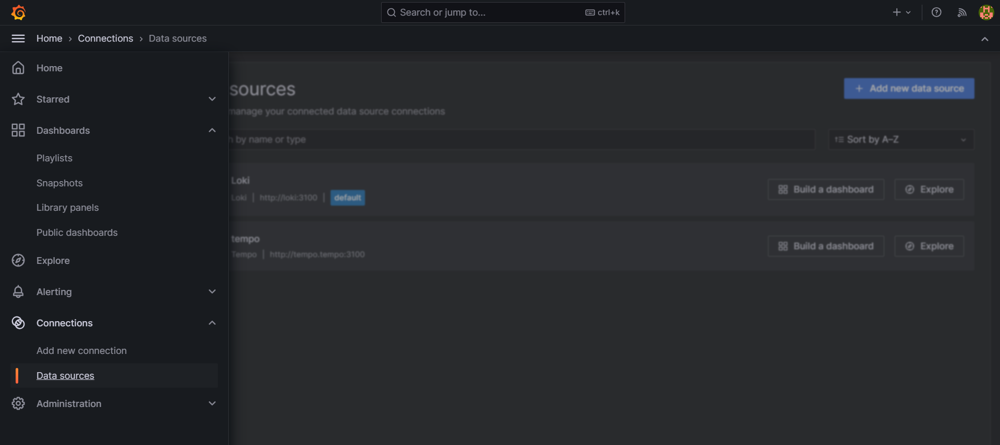
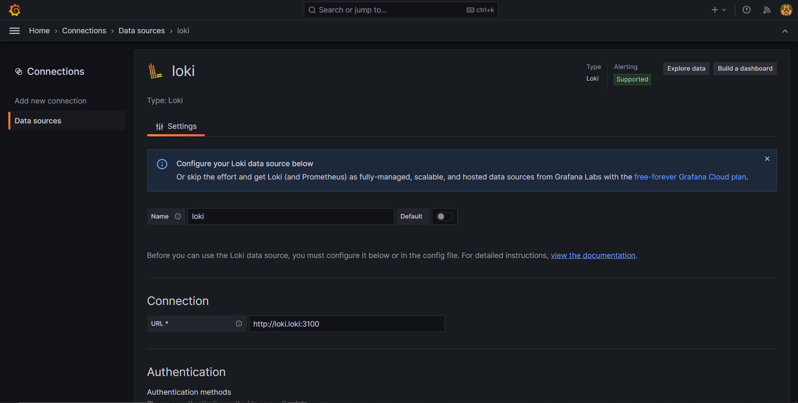

# LGTM Monitoring Stack 📺
[](https://github.com/vickyphang/k8s-monitoring/blob/main/LICENSE)


The **LGTM stack** is a combination of four open-source tools: **Loki, Grafana, Tempo, and Mimir**. This stack is designed for monitoring, logging, and tracing, offering a comprehensive solution for observability.

The LGTM stack: `Loki-for logs`, `Grafana-for dashboards and visualization`, `Tempo-for traces`, and `Mimir-for metrics`

### Prerequisites
- Kubernetes cluster
- Kubectl
- Helm
- Dynamic volume provisioning

## Setup LGTM
1. Add Helm repository
    ```bash
    # Add Helm repository
    helm repo add grafana https://grafana.github.io/helm-charts
    helm repo update
    ```

2. Deploy Loki
    ```bash
    # install loki
    helm install loki grafana/loki-stack -n loki --create-namespace
    ```
    >Notes:
    >There's a typo in the `chart grafana/loki-stack v2.10.2`, where it installed `loki 2.6.3` instead of `2.9.3`. Set the following value in your helm chart (or use the correct image):
    >```bash
    ># create loki-values.yaml
    >cat <<EOF | sudo tee loki-values.yaml
    >loki:
    >  image:
    >    tag: 2.9.3
    >EOF
    >
    ># run helm upgrade
    >helm upgrade --install  loki grafana/loki-stack -f loki-values.yaml -n loki
    >```

3. Deploy Grafana
    ```bash
    # install grafana
    helm install grafana grafana/grafana -n grafana --create-namespace

    # get grafana dashboard password
    kubectl get secret --namespace grafana grafana -o jsonpath="{.data.admin-password}" | base64 --decode ; echo

    # expose service grafana
    kubectl port-forward --namespace grafana svc/grafana 3000:80
    ```

4. Deploy Tempo
    ```bash
    # install tempo
    helm install tempo grafana/tempo -n tempo --create-namespace
    ```

5. Deploy Mimir
    ```bash
    # install mimir
    helm install mimir grafana/mimir-distributed -n mimir --create-namespace
    ```

## Setup Grafana Dashboard
1. Log in to Grfana
    
    Access your Grafana on the browser by searching as localhost:9090
    <p align="center">  </p>

2. Add datasource

    Once you log in you can see the home screen of Grafana, press the three lines at the top left corner you can see the menu then go to **Connections** > **Data sources**
    <p align="center">  </p>

    In Data sources, choose **Loki** and fill the endpoint. Finally you can hit **Save & test** button
    <p align="center">  </p>


## Troubleshoot
- **Mimir deployment**: PVC pending state
    - Set default dynamic storage class:
        ```bash
        kubectl patch storageclass csi-rbd-sc -p '{"metadata": {"annotations":{"storageclass.kubernetes.io/is-default-class":"true"}}}'
        ```

- **Mimir deployment**: mimir-nginx CrashLoopBackOff
    - Edit mimir-nginx configmap and match the resolver endpoint
        ```bash
        # Edit configmap
        kubectl edit cm mimir-nginx -n mimir

        # Match resolver endpoint
        apiVersion: v1
        data:
            nginx.conf: |
                ...
                http {
                    ...
                    resolver coredns.kube-system.svc.cluter.simple.;
                }
        ```
- **Grafana datasource**: Unable to connect with Loki
    - Edit loki-stack values.yml
        ```bash
        # get values.yml
        helm show values grafana/loki-stack > loki.yaml

        # use the correct image tag
        loki:
          ...
          image:
            repository: grafana/loki
            tag: 2.9.3

        # run helm upgrade
        helm upgrade --install  loki grafana/loki-stack -f loki.yaml -n loki
        ```