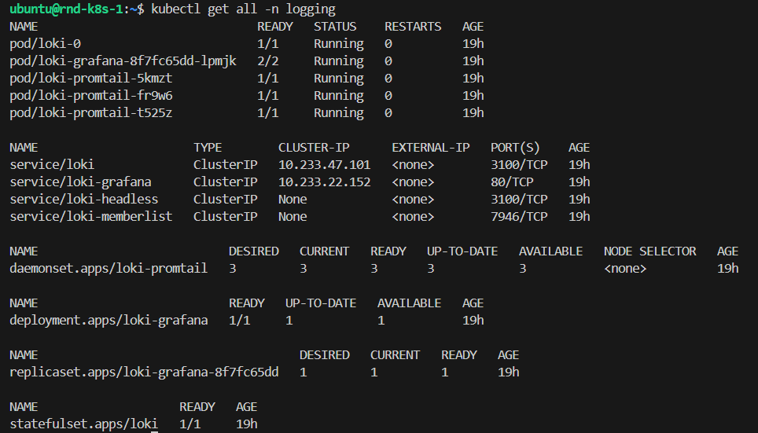
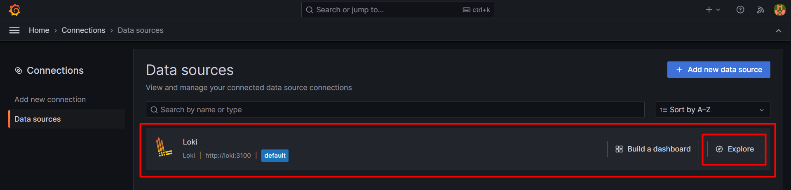
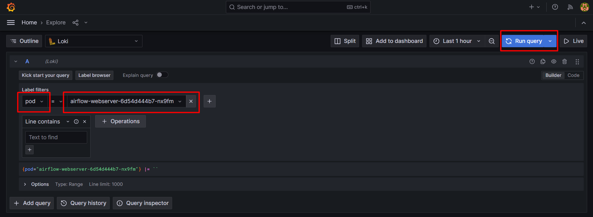
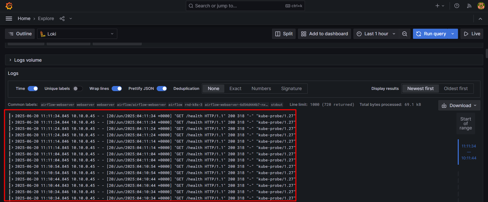
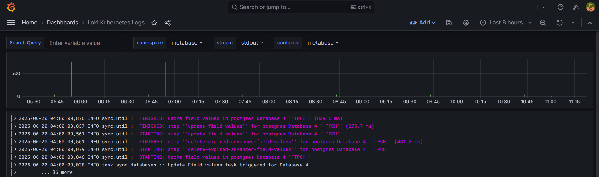

# Installing Loki, Promtail, and Grafana on Kubernetes

This guide provides step-by-step instructions for deploying a complete logging stack on your Kubernetes cluster using:
- **Loki**: A horizontally-scalable, highly-available log aggregation system
- **Promtail**: An agent that ships logs from your Kubernetes pods to Loki
- **Grafana**: For visualizing and querying your logs

## Table of Contents
- [Prerequisites](#prerequisites)
- [Installation](#installation)
- [Access Grafana](#access-grafana)
- [Configure Log Visualization](#configure-log-visualization)
- [References](#references)

## Prerequisites

- An existing Kubernetes cluster
- Helm 3 installed
- Ingress controller (optional, for external access to Grafana)

## Installation

### 1. Add Helm Repositories

First, add the necessary Helm repositories:

```bash
helm repo add grafana https://grafana.github.io/helm-charts
helm repo add loki https://grafana.github.io/loki/charts
helm repo update
```

### 2. Get the values.yaml of grafana/loki-stack helm chart
```bash
helm show values grafana/loki-stack > loki-values.yaml
```

### 3. Customize loki-values.yaml
```
test_pod:
  enabled: false
  image: bats/bats:1.8.2
  pullPolicy: IfNotPresent

loki:
  enabled: true
  isDefault: true
  url: http://{{(include "loki.serviceName" .)}}:{{ .Values.loki.service.port }}
  readinessProbe:
    httpGet:
      path: /ready
      port: http-metrics
    initialDelaySeconds: 45
  livenessProbe:
    httpGet:
      path: /ready
      port: http-metrics
    initialDelaySeconds: 45
  datasource:
    jsonData: "{}"
    uid: ""


promtail:
  enabled: true
  config:
    logLevel: info
    serverPort: 3101
    clients:
      - url: http://{{ .Release.Name }}:3100/loki/api/v1/push

grafana:
  enabled: true
  sidecar:
    datasources:
      label: ""
      labelValue: ""
      enabled: true
      maxLines: 1000
  image:
    tag: 10.3.3
```

### 4. Install loki stack including promtail, loki and grafana

```bash
helm upgrade --install loki -f loki-values.yaml -n logging --create-namespace grafana/loki-stack
```
<p align="center">  </p>


## Access Grafana

To access Grafana, first get the admin password:

```bash
kubectl get secret loki-grafana -n logging -o jsonpath="{.data.admin-password}" | base64 --decode
```

(If you have no ingress controller) Then port-forward to the Grafana service:

```bash
kubectl port-forward service/loki-grafana -n logging 3000:80

```

Access Grafana at `http://localhost:3000` (username: `admin`, password: from above command).

(In my case: i have Contour as ingress controller and cert-manager for certs management that uses let's encrypt) Expose service loki-grafana using ingress:
```yaml
---
apiVersion: networking.k8s.io/v1
kind: Ingress
metadata:
  name: loki-grafana
  namespace: logging
  annotations:
    kubernetes.io/ingress.class: contour
    cert-manager.io/cluster-issuer: letsencrypt-prod  # Request a certificate
spec:
  tls:
  - hosts:
    - grafana.registered.domain
    secretName: letsencrypt-tls  # Secret to store the certificate
  rules:
  - host: grafana.registered.domain
    http:
      paths:
      - path: /
        pathType: Prefix
        backend:
          service:
            name: loki-grafana
            port:
              number: 80
```
```bash
kubectl apply -f ingress.yaml
```
Access Grafana at `https://grafana.registered.domain` (username: `admin`, password: from above command).


## Configure Log Visualization
When we are using grafana/loki-stack helm chart, Loki has been configured In Data sources as shown below
<p align="center">  </p>

Then we can check all pods logs grafana explore section
<p align="center">  </p>

<p align="center">  </p>

Import a Grafana Dashboard for checking logs
- Go to grafana ui and select dashboard left-hand-menu and click new and import
- Enter the template ID → 15141 and click load
- Select Loki as a data source

<p align="center">  </p>

## References

- [Install Loki, Promtail and Grafana on Kubernetes](https://medium.com/@sariiersinn13/install-loki-promtail-and-grafana-on-kubernetes-2a19ffcb7f26)
- [Grafana Loki Documentation](https://grafana.com/docs/loki/latest/)